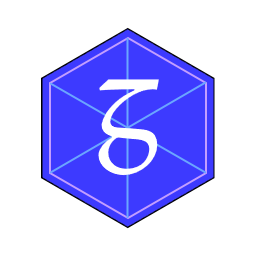

# GASM
*The [GASM Home Site](https://hongtianyu.github.io/gasm-web/) with the Demonstrative JS-GASM Implementation.*

---

    

        
    

    

        
        
        
        
        
    

---

## About This Repository

In this repository is my Year 10 IST Project &mdash; a website containing the tutorial, documentation, and specifications of an esoteric programming language I invented that allows graphics to be created precisely and programmatically. It also includes a live playground and an interactive shell (the shell was a bit coarse, as I recall myself running out of time when I coded that part).

Being only a small project created for an assessment task, this website (and engine implementation) still has much room for refinement and improvement. However, I have decided to leave the project in its original state to document my early explorations of web and programming language design.

Something to note is the poor compatibility of this website. Back then, I was still learning to do the most basic of things in HTML, CSS, and JS as I developed this site, and I only recall testing it in Microsoft Edge (the old one that used EdgeHTML) and Google Chrome. And again, even these two browsers have changed a lot in the past two years.  

So please don't at all be surprised if you find parts of this site randomly breaking in your browser. :sweat_smile:

 

> *In memory of those carefree days.*

